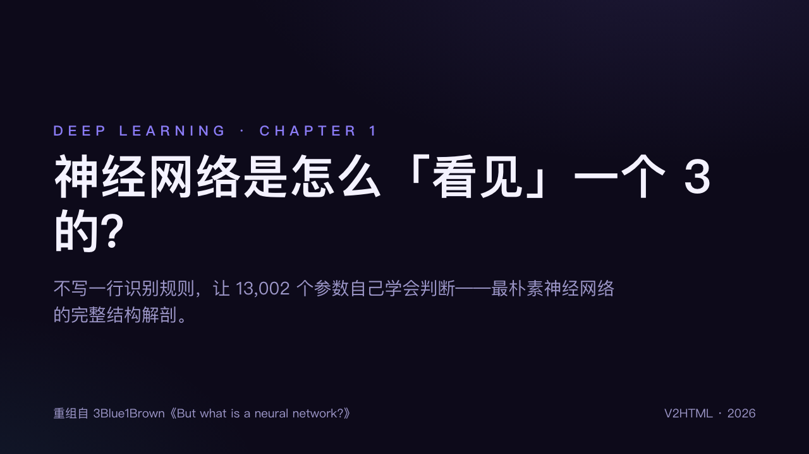
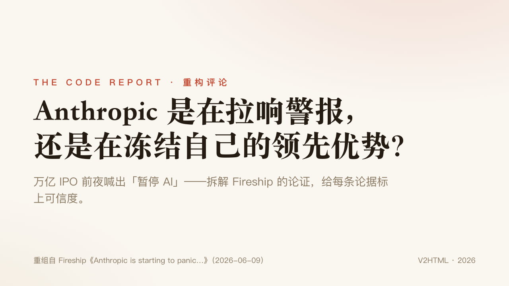
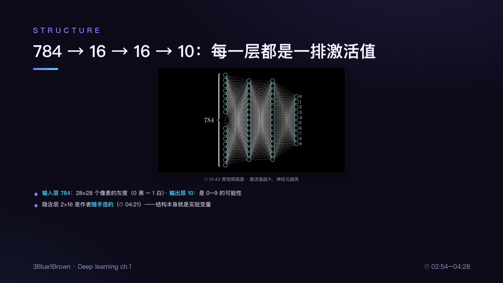
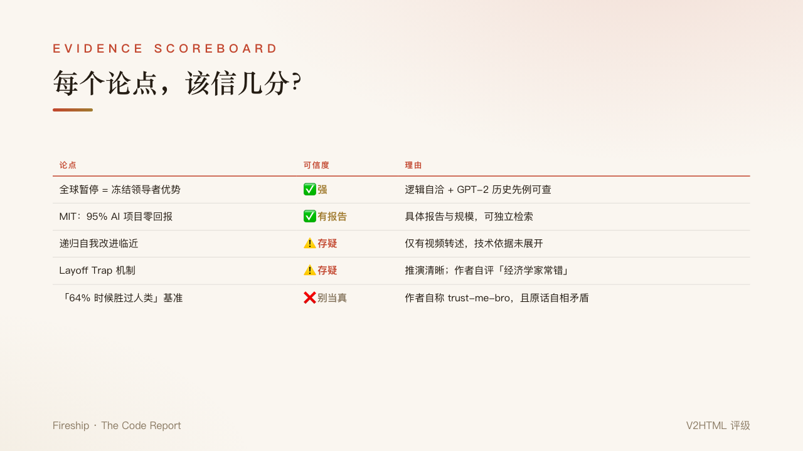
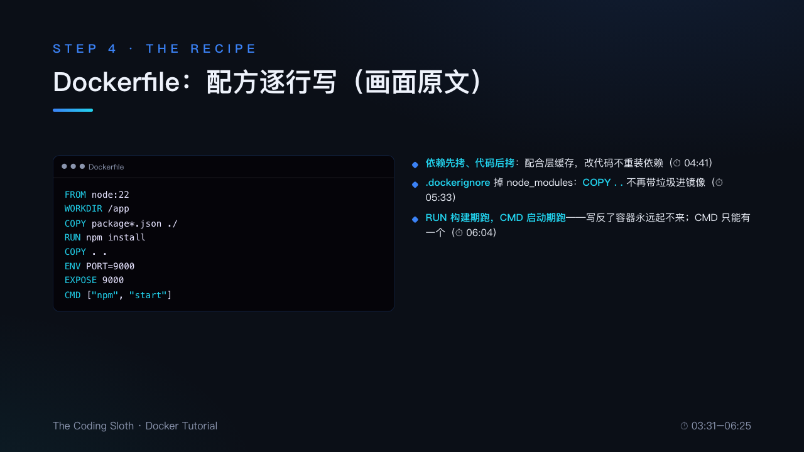
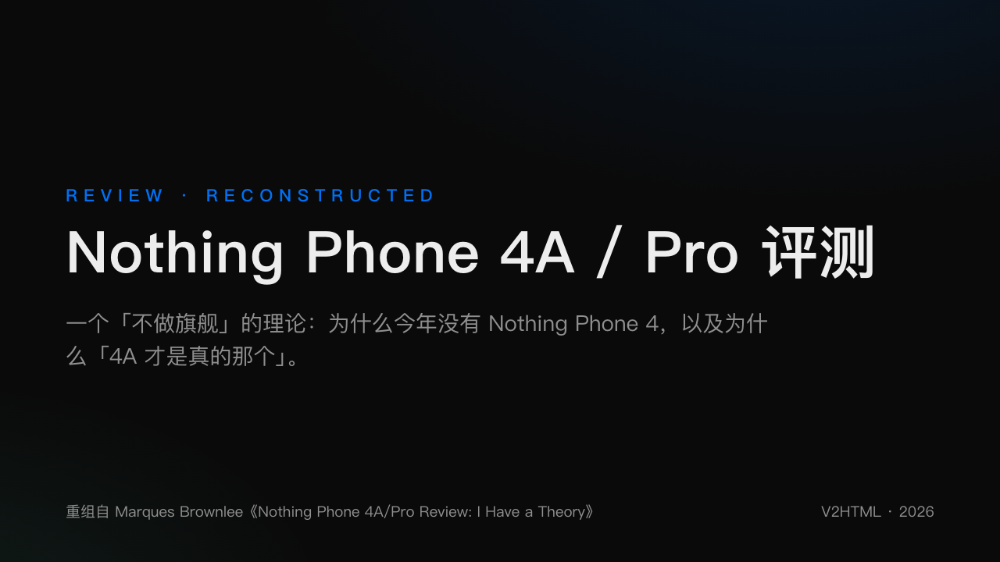
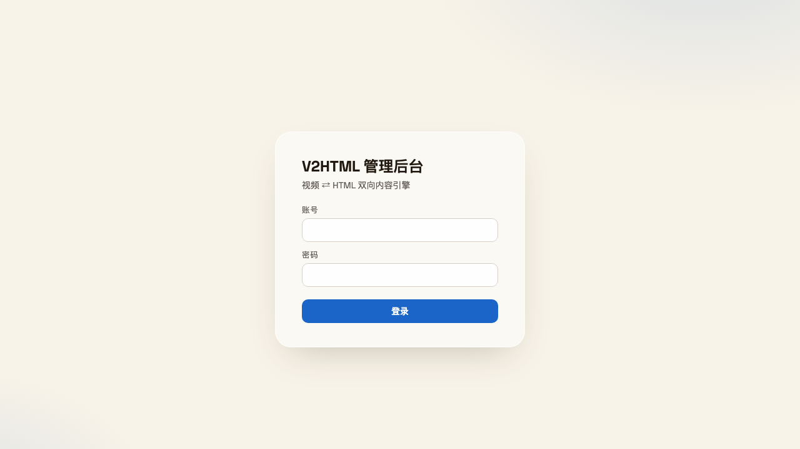

<div align="center">

# V2HTML

### 视频 ⇄ HTML 双向内容引擎

把一条 YouTube 视频，变成**可直接上线的文章**与**重新设计的可放映幻灯片**；再把任意文章，变成**可生成的视频物料**。

[](https://www.python.org/)
[](https://fastapi.tiangolo.com/)
[](templates/slides.html)
[](#license)

**[在线演示 · 幻灯片](https://nownexts.com/VTH/output/aircAruvnKk/slides.html)** ·
**[管理后台](https://nownexts.com/VTH/admin)** ·
[使用文档（中文）](#快速开始)

</div>

---

## 它解决什么问题

看视频学东西很慢，视频里的知识**没法搜索、没法引用、没法分享**；而把视频手工整理成文章和 PPT，一小时的视频往往要花三小时。

V2HTML 把这件事变成一条命令：**确定性工作**（抓取、字幕、抽帧）交给脚本，**语义工作**（文体判定、结构重组、写作、幻灯片设计）交给 LLM——产出不是流水账字幕，而是按论证结构重写的、可直接发布的内容。

| 视频类型 | 产出 | 示例 |
|---|---|---|
| 教程类 | 可复现的教程文档（命令逐字核对 + 避坑清单） | Docker 入门 → 教程 |
| 科普类 | 分层递进的科普文章（直觉 → 机制 → 边界 + FAQ） | 3Blue1Brown → 科普 |
| 口播评论 | 论点拆解 + 论据可信度分级（✅⚠️❌） | Fireship → 评论 |
| 评测/访谈 | 评分卡前置的评测纪要 / 议题分组纪要 | MKBHD → 评测 |

**同一次分析，同时产出**：`doc.md`（文章）+ `slides.html`（30 主题重构型幻灯片，非截图拼贴）。

## 效果预览

| 科普 · 夜紫主题 | 评论 · 暖纸衬线主题 |
|---|---|
|  |  |
|  |  |

| 教程 · 深空蓝主题 | 评测 · 纯黑极简主题 |
|---|---|
|  |  |

> 幻灯片为**重构**而非截图拼贴：跟随论证结构重组，仅嵌入含独有信息的原视频帧（图表/界面/演示物），每页标注原视频时间戳，浏览器即可放映（`→` 翻页 / `O` 总览 / `F` 全屏 / `P` 导出 PDF / `T` 切换 30 主题）。

## 工作原理

```
                    ┌─────────────────────────────────────────┐
                    │  bin/v2h.py —— 确定性素材管线            │
  YouTube URL ────▶ │  代理探测 · 480p视频 · 字幕(人工优先)     │
                    │  场景抽帧 · 联览图 · ASR滚动去重          │
                    └────────────────┬────────────────────────┘
                                     ▼
                    ┌─────────────────────────────────────────┐
                    │  语义核心 —— 同一套方法论，两种形态        │
                    │                                         │
                    │  客户端: ZCode 技能按 prompts/ 亲自执行   │
                    │  服务端: server/ 组装为 LLM API 调用      │
                    │                                         │
                    │  文体判定 → 文档写作 → 幻灯片编排          │
                    └────────────────┬────────────────────────┘
                                     ▼
              doc.md ─── slides.html(30主题) ─── 自动推送 openflow
                                     │
                    ┌────────────────▼────────────────────────┐
                    │  逆向 v2video：文章/PPT → 分镜提示词包     │
                    │  （Sora/Veo/可灵）或 HTML 动画演示         │
                    └─────────────────────────────────────────┘
```

**设计契约**：`prompts/` 里沉淀的方法论（文体模板、幻灯片设计系统、防幻觉规则——数字逐字核对、补全显式标注、作者立场与写作者立场分离）是整个系统的核心资产，客户端与服务端共用。

## 快速开始

### 客户端（配合 ZCode，质量上限最高）

```bash
git clone https://github.com/sevenaaaaaaaaa/V2HTML.git && cd V2HTML
pip3 install yt-dlp                      # ffmpeg 需已安装
bash bin/install-skills.sh               # 注册 /v2html /v2video 技能
```

之后在 ZCode 里说一句：**“用 v2html 把这条视频转成教程和幻灯片：<url>”** 即可。

### 服务端（浏览器提交，全自动）

```bash
git clone https://github.com/sevenaaaaaaaaa/V2HTML.git && cd V2HTML
python3 -m venv .venv && .venv/bin/pip install -r requirements.txt
echo "V2HTML_LLM_API_KEY=你的key" >> .env    # 任何 OpenAI 兼容接口
bash server/run.sh                           # http://0.0.0.0:8400
```

打开 `http://localhost:8400` 提交链接，等待产物；`/admin` 进入管理后台。

<details>
<summary><b>公网服务器部署（Apache 子路径 + systemd，本项目的线上形态）</b></summary>

```bash
# 1. 代码 + 环境（CentOS7 等老系统：uv 装 Python3.12，ffmpeg 用全静态构建）
uv venv --python 3.12 .venv && uv pip install --python .venv/bin/python -r requirements.txt
# 2. 环境变量
cat > .env <<EOT
V2HTML_LLM_API_KEY=你的key
V2HTML_LLM_BASE_URL=https://api.deepseek.com/v1
V2HTML_LLM_MODEL=deepseek-chat
EOT
# 3. systemd
cat > /etc/systemd/system/v2html.service <<UNIT
[Service]
WorkingDirectory=/www/wwwroot/V2HTML
EnvironmentFile=/www/wwwroot/V2HTML/.env
Environment=PATH=/www/wwwroot/V2HTML/bin:/usr/bin:/bin
ExecStart=/www/wwwroot/V2HTML/.venv/bin/uvicorn server.app:app --host 127.0.0.1 --port 8410
Restart=always
[Install]
WantedBy=multi-user.target
UNIT
systemctl enable --now v2html
# 4. Apache 子路径（nginx 同理，反代到 8410 即可）
echo 'ProxyPass /VTH/ http://127.0.0.1:8410/
ProxyPassReverse /VTH/ http://127.0.0.1:8410/' > /www/server/panel/vhost/apache/extension/<域名>/v2html.conf
```

管理后台：`https://你的域名/VTH/admin`（首次启动前运行
`.venv/bin/python -c "import sys;sys.path.insert(0,'.');from server import auth;auth.set_credentials('admin','你的密码')"`）。

</details>

## 管理后台

服务端自带 openflow 风格的管理后台（oklch 设计令牌、玻璃卡片、亮暗自适应）：仪表盘、任务管理（重试/推送/删除）、任务详情（执行日志 + 文档预览）、LLM 在线配置与连接测试、推送开关与发布状态切换。



## 推送到 openflow

与 [openflow](https://github.com/sevenaaaaaaaaa/openflow)（PHP 内容站点）深度集成：任务完成后自动把文章写入其内容库（幂等覆盖、写前备份、保持文件属主），附带来源视频链接与配套幻灯片链接，默认草稿态、后台一键发布。也提供 `POST /api/jobs/{id}/push` 手动触发。

## HTTP API

| 方法 | 路径 | 说明 |
|---|---|---|
| `POST` | `/api/jobs` | 创建任务 `{url, doc_type: auto\|tutorial\|science\|commentary\|other, theme, max_frames}` |
| `GET` | `/api/jobs` / `/api/jobs/{id}` | 任务列表 / 详情（进度、日志、产物链接） |
| `GET` | `/api/jobs/{id}/doc` | 文档纯文本 |
| `POST` | `/api/jobs/{id}/retry` `/push` `/delete` | 重试 / 推送 openflow / 删除 |
| `GET` `/POST` | `/api/config` | 读取 / 更新 LLM 与推送配置 |
| `GET` | `/api/health` | 健康检查（LLM/代理/推送状态） |

公网部署时设置 `V2HTML_TOKEN`，写接口需要 `Authorization: Bearer <token>`。

## 30 主题幻灯片库

`<html data-theme="...">` 一键换肤，放映中按 `T` 实时循环；亮暗主题自动适配。

| 家族 | 主题 |
|---|---|
| 自研基础 | `science` 夜紫（科普）· `tutorial` 深空蓝（教程）· `commentary` 暖纸衬线（评论） |
| 产品风致敬（键名无商标） | `terracotta` ≈Claude · `paper-doc` ≈Notion · `prism` ≈Arc · `aurora` ≈Linear |
| 当代平面风格（组件级差异） | `glass` 毛玻璃 · `memphis` 孟菲斯 · `vapor` 蒸汽波 · `riso` 孔版印刷 · `broadsheet` 报刊 · `luxe` 奢侈极简 · `academia` 暗色学院 · `y2k` 千禧 · `blueprint` 蓝图 · `pop` 波普 |
| 设计运动 | `zen` 日式极简 · `swiss` 国际主义 · `bauhaus` 包豪斯 · `deco` 装饰艺术 · `brutal` 新粗野 · `kraft` 牛皮纸 · `neon` 赛博未来 |
| 设计系统收编 | `geist` Vercel · `carbon` IBM · `ant` · `tdesign` · `arco` · `material3` |

## 项目结构

```
bin/v2h.py            素材管线：fetch / transcribe / frames / status
prompts/              方法论资产：文体写作法 ×4 · 幻灯片设计法 · 分类规则 · 逆向分镜法 ×2
templates/slides.html 幻灯片引擎（单文件、零依赖、30 主题、防溢出、截图模式）
server/               FastAPI 服务端：任务队列 · 管理后台 · LLM 热配置 · openflow 推送
skills/               ZCode 客户端技能（/v2html /v2video）
docs/images           本页配图
```

## Roadmap

- [ ] 服务端接入 Whisper 容器（无字幕视频兜底）
- [ ] 任务列表持久化（当前重启清空，产物不受影响）
- [ ] 视频直出模式（分镜 JSON → 渲染 API）
- [ ] 英文界面与多语言产出

## 致谢

方法论的诚实性规则受 3Blue1Brown、Fireship、MKBHD 等创作者的内容启发；设计系统收编自 [Vercel Geist](https://vercel.com/geist)、[IBM Carbon](https://carbondesignsystem.com)、[Ant Design](https://ant.design)、[TDesign](https://tdesign.tencent.com)、[Arco Design](https://arco.design)、[Material 3](https://m3.material.io) 的公开 token；[W3C Design Tokens](https://www.designtokens.org)。

<div align="center">

**V2HTML** — 看完一条视频，得到一堆可上线的内容。

© 2026 · 保留所有权利 · 重建内容版权归原作者所有，发布前请确认授权

</div>
