<div align="center">

# ConFlow —— 看完一条视频，得到一堆可上线的内容

**你不用再「回头整理一下视频」。贴一条链接，拿回一篇能直接发布的文章，和一套能当众放映的幻灯片。**

[](LICENSE)
[](https://www.python.org/)
[](https://fastapi.tiangolo.com/)
[](templates/slides.html)

[在线演示 · 幻灯片](https://nownexts.com/VTH/output/aircAruvnKk/slides.html) · [管理后台](https://nownexts.com/VTH/admin) · [使用指南](docs/USAGE-GUIDE.md) · [功能总附录](#附录--功能总表每个模块的截图--介绍--使用说明)

</div>

---

## 这是什么：为什么看过的视频，最后什么都没留下

看视频学东西很慢，更慢的是**用起来**：视频没法搜索、没法引用、没法贴进文档。想分享给同事，只能甩个链接加一句「这段讲得挺好」。手工把一小时视频整理成文章和 PPT？往往要三个小时，然后你就放弃了。

ConFlow 把这件事变成一条命令：**贴一条 YouTube 链接，20 分钟后拿回两份东西**——

- **一篇按论证结构重写的文章**（不是字幕流水账）：教程带逐字核对过的命令和避坑清单，科普分层递进，评论把论点和论据可信度摆开给你看；
- **一套重新设计的幻灯片**（不是视频截图拼贴）：30 种主题浏览器直接放映，每页写论断句、标注原视频时间戳，讲错了随时回跳核对。

它怎么做到的？把工作拆成两层：**抓取、字幕、抽帧这些确定性工作交给脚本**，保证可复现；**判定文体、重组结构、写作、设计幻灯片这些语义工作交给 LLM**——但 LLM 不是自由发挥，它按 `prompts/` 里沉淀的一套写作法干活，数字必须逐字核对、没讲清的补全必须显式标注、视频作者的观点和补全的署名严格分开。

反方向也成立：`v2video` 能把一篇旧文章逆向成**分镜提示词包**（Sora / Veo / 可灵直接可用），或输出 HTML 动画演示。视频变内容，内容再变回视频。

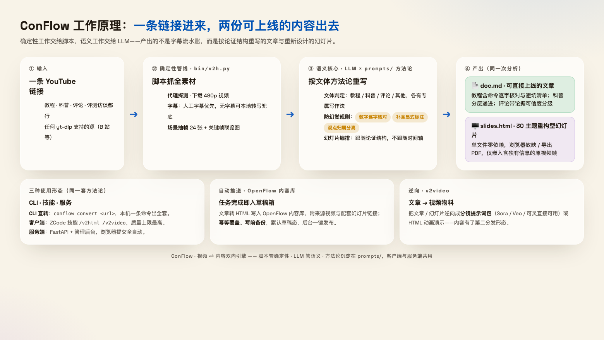

## 它长什么样：从提交到上线，就三步

**① 贴链接** —— 前台页面上贴一条视频链接，选文体（或让系统自动判定），提交。也可以在 ZCode 里说一句「用 v2html 把这条视频转成教程」，走本机技能。


**② 等它跑完** —— 脚本抓素材（视频、字幕、关键帧），LLM 按文体方法论写作和编排幻灯片。浏览器里能看到任务状态；管理后台里有每一步的执行日志。

**③ 直接用** —— 文章可自动推进 [OpenFlow](https://github.com/sevenaaaaaaaaa/openflow) 内容库草稿箱，审完一键发布；幻灯片浏览器打开就能放映，按 `P` 导出 PDF。

下面都是真实产物（本仓库 output/ 目录原样可查，无任何手工排版）：

| 科普 · 3Blue1Brown | 评论 · Fireship |
|---|---|
| 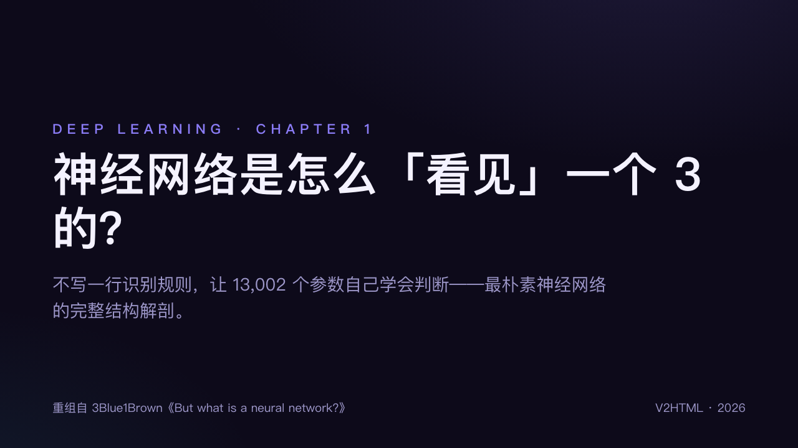 | 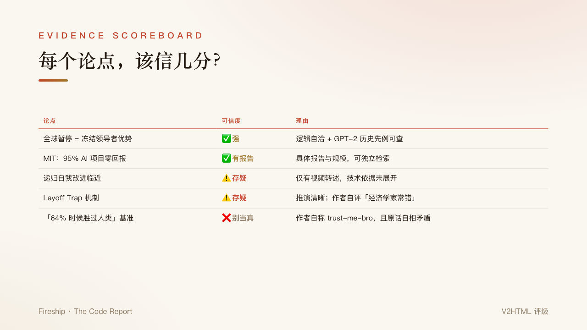 |
| **结构页：嵌入原视频帧 + 时间戳** | **教程 · Docker（命令逐字核对）** |
| 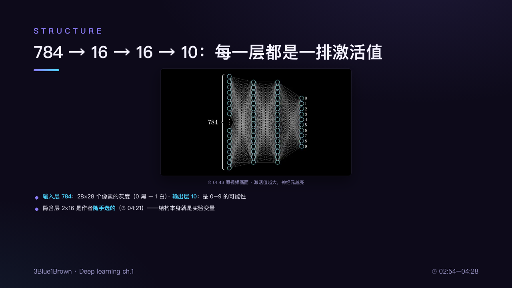 | 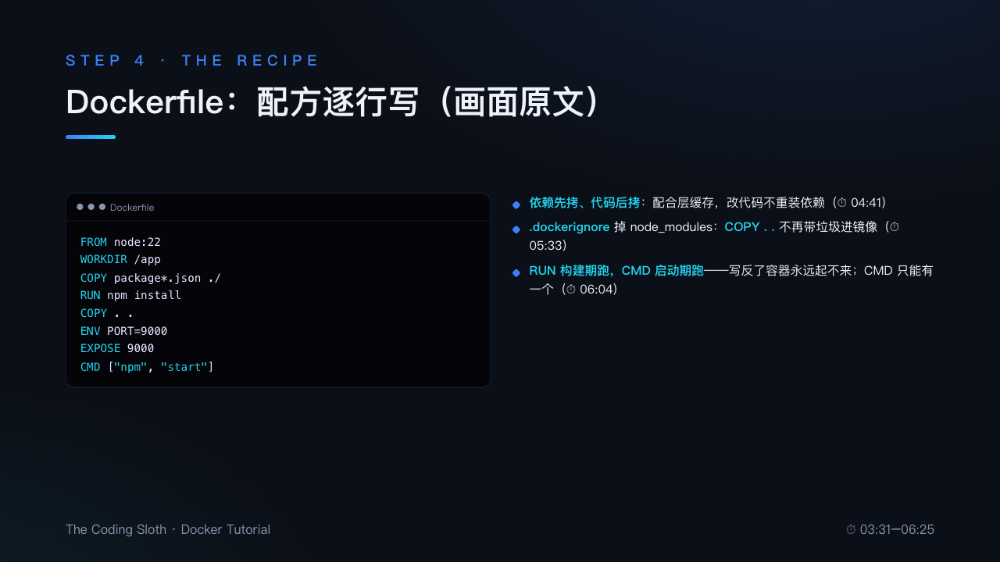 |

同一份内容，30 种主题一键换肤（放映中按 `T` 实时切换，复制地址栏即分享同款风格）：


**「重构」和「截图拼贴」差在哪？** 截图拼贴是时间的碎片；重构是论证的空间化——标题写论断句、每页一个论点、只嵌入含独有信息的原视频帧（图表 / 界面 / 实物）。逐帧对照见前台[「重构长什么样」](https://nownexts.com/VTH/#anatomy)一节，下面是其中两组：

| 对照：要点页 | 对照：数据卡 |
|---|---|
| 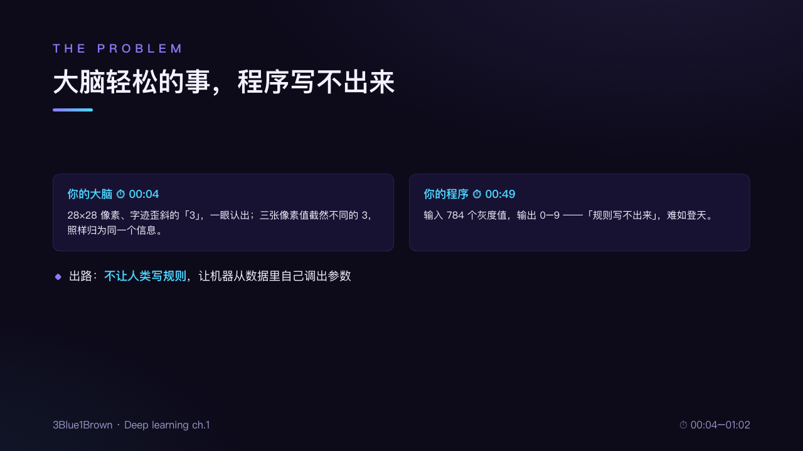 | 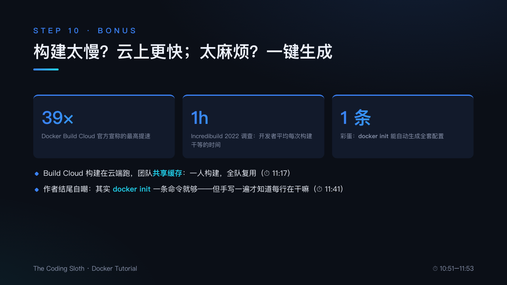 |

任务完成自动推送：文章转成 HTML 写入 OpenFlow 内容库，带来源视频和配套幻灯片链接，默认草稿态——后台看到的就是下面这样，一键发布。

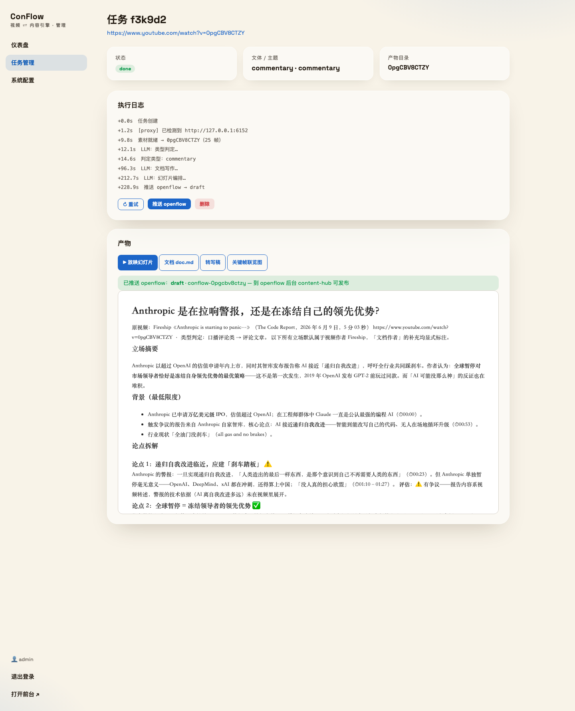

## 特色能力

### 四种文体，四种写作法——不是「总结视频」

教程、科普、口播评论、评测访谈，读者的期待完全不同。ConFlow 为每种文体沉淀了专属写作法（`prompts/doc-*.md`）：教程要命令逐字核对 + 避坑清单；科普要直觉 → 机制 → 边界分层递进 + FAQ；评论要论点拆解 + 论据可信度分级（✅⚠️❌）；评测要评分卡前置。系统先判定文体，再按对应方法论执行——也可以手工指定。

### 防幻觉是规则，不是愿望

LLM 写东西会一本正经胡说八道，所以方法论里写死了防线：**数字与命令必须对照转写稿和视频帧逐字核对**；视频没讲清但流程必需的内容，用「💡 补全」显式标注；观点归属严格分离——视频作者的归作者，补全的署名写作者。每页幻灯片都带原视频时间戳，方便回溯核对。

### 双形态运行，同一套方法论

- **客户端（ZCode 技能）**：`/v2html` `/v2video` 一句话驱动，LLM 由 ZCode 承担，质量上限最高；
- **服务端（FastAPI + 管理后台）**：浏览器提交、任务队列全自动、LLM 在线热配置，适合团队和自己挂在服务器上跑。

两边读的是同一份 `prompts/`——方法论是核心资产，形态只是壳。

### 诚实边界

无字幕视频由内置 faster-whisper 转写兜底（CPU 可跑）；AI 产出质量取决于你配置的模型。详见[当前边界](#当前边界诚实声明)。

## 快速开始

### 客户端（配合 ZCode，质量上限最高）

```bash
git clone https://github.com/sevenaaaaaaaaa/V2HTML.git && cd V2HTML  # 仓库名沿用 V2HTML,产品名 ConFlow
pip3 install yt-dlp                      # ffmpeg 需已安装
bash bin/install-skills.sh               # 注册 /v2html /v2video 技能
```

之后在 ZCode 里说一句：**「用 v2html 把这条视频转成教程和幻灯片：<链接>」**即可。

### 服务端（浏览器提交，全自动）

```bash
git clone https://github.com/sevenaaaaaaaaa/V2HTML.git && cd V2HTML  # 仓库名沿用 V2HTML,产品名 ConFlow
python3 -m venv .venv && .venv/bin/pip install -r requirements.txt
echo "CONFLOW_LLM_API_KEY=你的key" >> .env    # 任何 OpenAI 兼容接口
bash server/run.sh                           # http://0.0.0.0:8400
```

打开 `http://localhost:8400` 贴链接提交；`/admin` 进管理后台。公网部署（Apache 子路径 + systemd）、API 鉴权见 [使用指南](docs/USAGE-GUIDE.md)。

## 开源开放

**ConFlow 的核心功能——包括最值钱的 `prompts/` 方法论和 30 主题幻灯片引擎——过去、现在、将来都永久开源，MIT 协议。**

- **商业化边界**：我们还没想好有什么必须商业化的——当前唯一的「付费位」留给**需要定制化开发的项目**（私有视频源接入、企业内容库对接、专属文体写作法等）。核心开源版永远够用，这是承诺。
- **开源生态**：ConFlow 是[芭乐派](https://nownexts.com)产品矩阵 Studio 层的本地工具，与 [OpenFlow](https://github.com/sevenaaaaaaaaa/openflow)（入口层）及 MFlow / inFlow / PayFlow / LearnFlow / WebsFlow 等 Flow 家族**互相开源、互相打通**——ConFlow 产出的内容一键进入 OpenFlow 内容库，视频 → 文章 → 站点发布一条链路。
- **开发者做插件**：ConFlow 的扩展点就是文件，改完即生效——
  - **新文体** = 往 `prompts/` 加一个 `doc-你的文体.md`（写作法）+ 在分类规则里加几行；
  - **新主题** = 往 `templates/slides.html` 加一段 `[data-theme="你的主题"]` CSS（六个变量起步，组件级覆写随意）；
  - **新推送目标** = 参照 `server/pushof.py` 写一个适配器（word­press / Notion / 静态站……）；
  - **新视频源** = yt-dlp 支持的就已支持（YouTube / B 站 / …），无需开发。
  
  更正式的插件规范与示例库在路线图上，欢迎先 fork 玩起来——善意 fork 与二次开发均受 MIT 保护。

## 文档

[使用指南](docs/USAGE-GUIDE.md) · [路线图](docs/ROADMAP.md) · [方法论与提示词](prompts/) · [幻灯片引擎](templates/slides.html) · [架构示意图源文件](docs/diagrams/architecture.html)

---

## 附录 · 功能总表（每个模块的截图 · 介绍 · 使用说明）

> 按六个模块组织，与实际入口一一对应。每项含：功能介绍（1–2 句，讲用户价值）/ 使用说明（怎么开始用）/ 截图。
> 管理后台截图为演示环境的示例任务；其余均为真实产物。

### 一、前台提交页 `服务端首页 · /`

整页导览（从上到下：提交 → 三步原理 → 30 主题现场换肤 → 重构对照 → 四文体 → 示例作品 → FAQ → 提交表单）：

📷 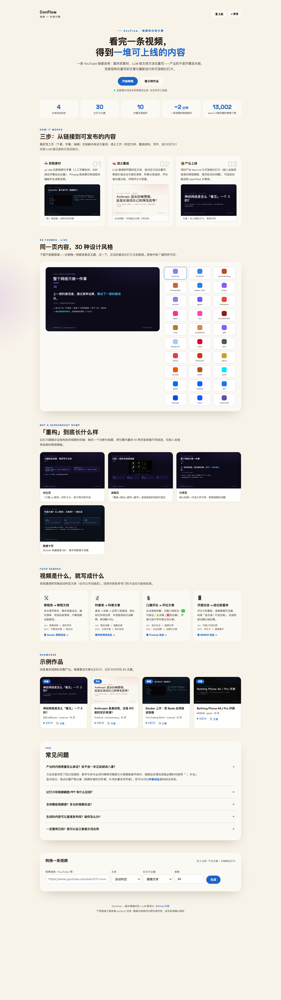

#### 提交表单 `首页底部 · 我找一条视频试试`

贴一条视频链接，选文体（自动判定 / 教程 / 科普 / 评论 / 其他）与画面帧数，点「提交」即建任务。提交后页面实时显示任务状态，完成即给出文章与幻灯片入口。

**怎么用**：打开服务端首页 → 底部表单贴链接 → 提交 → 等状态变为完成。（批量任务走管理后台「快速提交」或 HTTP API。）

#### 示例作品区 `首页 · SHOWCASE`

四套真实生成的成品（科普 / 评论 / 教程 / 评测各一），每张卡片直达幻灯片放映与文章原文——先看成品再决定要不要自己跑。

**怎么用**：首页「示例作品」区，点卡片上的「幻灯片」或「文章」。

#### 30 主题现场换肤 `首页 · TO THEME LIST`

同一页幻灯片内容，30 种设计风格即点即换——自研风、产品风致敬、当代平面、设计运动、设计系统收编五个家族。放映中按 `T` 也能循环，切到喜欢的直接复制地址栏（`?theme=` 参数随 URL 走）分享同款。

**怎么用**：首页主题区点任意色块；或放映中按 `T`。

#### 「重构长什么样」对照区 `首页 · NOT A SCREENSHOT DUMP`

四组「原视频帧拼贴 vs ConFlow 重构页」的逐帧对照，直观展示「论证的空间化」和「截图拼贴」的差别。

**怎么用**：首页「重构长什么样」一节，左右对比着看。

#### 亮暗模式 `首页右上角 · 🌓 主题`

前台与管理后台均自适应系统亮暗，也可手动切换（记忆在浏览器 localStorage）。

**怎么用**：右上角「🌗 主题」按钮。

### 二、管理后台 `/admin`

#### 登录 `后台 → /admin/login`

PBKDF2 哈希凭据 + HMAC 签名会话 Cookie（7 天有效）。首次部署前用一行命令设置管理员账号密码。

**怎么用**：`.venv/bin/python -c "import sys;sys.path.insert(0,'.');from server import auth;auth.set_credentials('admin','你的密码')"` → 访问 `/admin` 登录。

📷 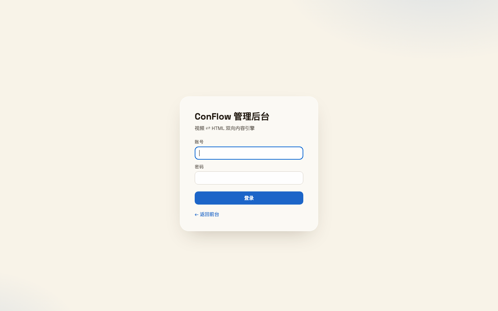

#### 仪表盘 `后台 → 仪表盘`

服务运行概览：任务总数 / 进行中 / 已完成 / 失败四张统计卡，LLM 配置状态、自动推送状态、主题库规模、前台入口，底部是最近任务表和**快速提交**表单（后台也能直接贴链接建任务）。数据每 5 秒自动刷新。

**怎么用**：登录后台即落地仪表盘；底部「快速提交」贴链接即可建任务。

📷 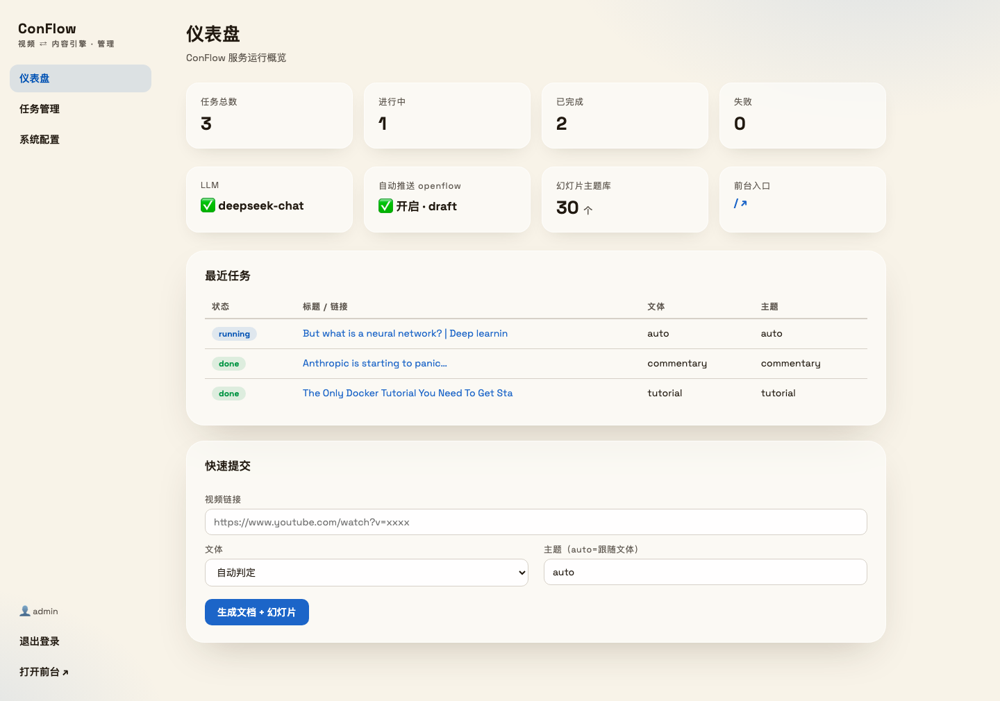

#### 任务管理 `后台 → 任务管理`

全部任务的列表视图：状态徽标（queued / running / done / error / paused_no_llm）、创建时间、文体与主题，每个任务行内直接 **详情 / 幻灯片 / 推送 / 重试 / 删除**。删除会连同产物目录一起清掉（有确认弹窗）。

**怎么用**：后台 → 任务管理；失败的点 ↻ 重试，完成的点「推送」进 OpenFlow。

📷 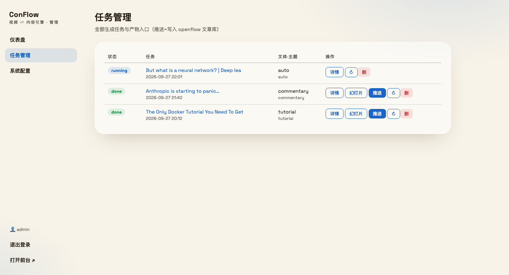

#### 任务详情 `后台 → 任务管理 → 点任一任务`

单个任务的完整档案：状态卡（进行中每 5 秒自动刷新）、**逐步计时的执行日志**（代理探测 → 素材就绪 → 类型判定 → 文档写作 → 幻灯片编排 → 推送）、产物四件套入口（放映幻灯片 / 文档 doc.md / 转写稿 / 关键帧联览图）、文档内嵌预览、以及推送结果横幅（草稿态 + slug，直达 OpenFlow 后台发布）。

**怎么用**：任务管理 → 点标题进详情；产物按钮直接打开对应文件。

📷 

#### 系统配置 `后台 → 系统配置`

三组配置即时持久化到 `server-data/config.json`（密钥只存服务器本地，不进代码库）：

- **LLM 语义生成**：Base URL / 模型 / API Key / 最大 Token / 视觉开关（文档步骤附带联览图，需视觉模型），改完点「测试连接」立即验证——换模型不用重启服务；
- **推送到 OpenFlow**：自动推送开关、推送状态（草稿 / 直接发布）、文章分类、作者署名、OpenFlow 数据目录；
- **管理员密码**：改账号密码。

**怎么用**：后台 → 系统配置 → 改完点对应「保存」；LLM 配好先「测试连接」再走任务。

📷 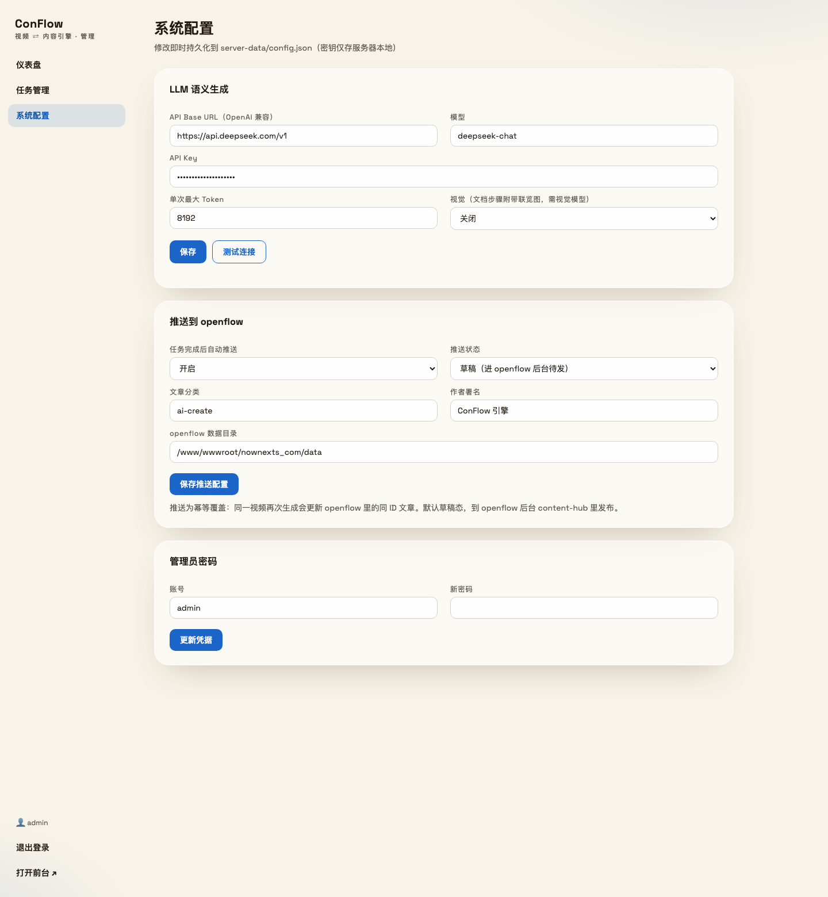

### 三、幻灯片引擎 `output/<视频ID>/slides.html（单文件，零依赖，离线可用）`

#### 放映操作

`→` `←` `空格` 翻页（要点逐条入场）· `O` 总览模式（缩略图全览，点击跳页）· `F` 全屏 · `P` 打印 / 导出 PDF（浏览器打印对话框，布局已适配）· `T` 实时切换 30 主题（同步到地址栏）· `?` 帮助。

**怎么用**：浏览器打开 slides.html，按 `F` 全屏开讲；讲完按 `P` 导出 PDF 存档外发。

#### 30 主题库

五个家族：自研（science 夜紫 / tutorial 深空蓝 / commentary 暖纸衬线）、产品风致敬（terracotta / paper-doc / prism / aurora，键名无商标）、当代平面（glass / memphis / vapor / riso / broadsheet / luxe / academia / y2k / blueprint / pop，组件级差异不只换色）、设计运动（zen / swiss / bauhaus / deco / brutal / kraft / neon）、设计系统收编（geist / carbon / ant / tdesign / arco / material3）。亮色主题自动适配分隔线与底色。

**怎么用**：URL 加 `?theme=bauhaus` 直达；放映中按 `T` 循环。

📷 

#### 重构页型与原视频帧

10 种页型（封面 / 要点 / 章节页 / 引用 / 对话 / 数据卡 / 代码对照 / 流程 / 表格 / 图文）承载不同信息类型；原视频帧只嵌入含独有信息的（图表 / 界面 / 实物），每张带 `⏱ 时间戳` 图注。

📷  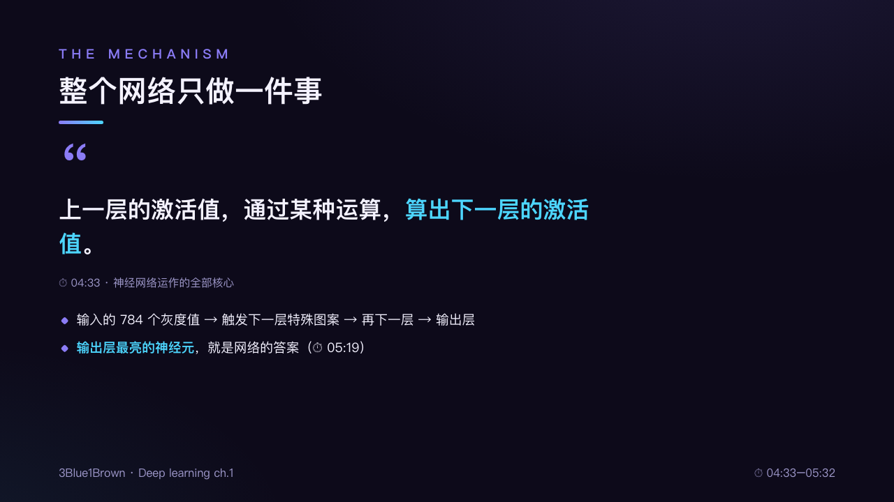 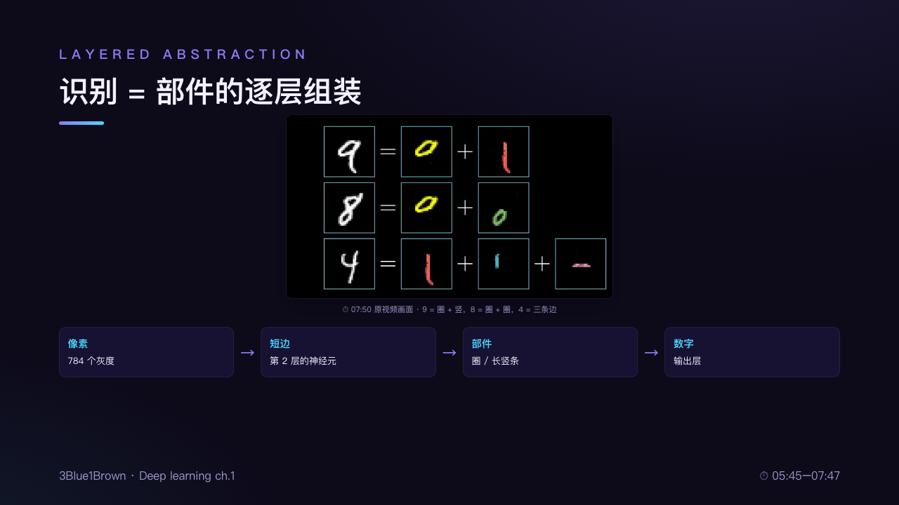 

#### 截图质检模式 `slides.html?shot=页码`

单页静态渲染（禁用入场动画），供 PNG 导出与自动化视觉质检——本仓库四套 demo 每页都过了这一关。

**怎么用**：`slides.html?shot=3` 渲染第 3 页，配合无头 Chrome 截图即可批量出图。

#### 防溢出排版

内容区自动防溢出：要点超限自动收缩行距与字号，超长页面在总览里一目了然——不会出现「放映到一半字被裁掉」。

### 四、客户端 CLI `bin/v2h.py（确定性素材管线）`

📷 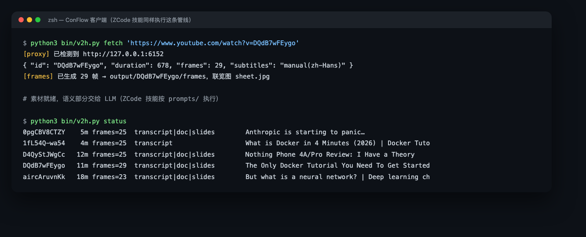

#### fetch `python3 bin/v2h.py fetch '<视频URL>'`

一条命令抓全素材：代理探测（自动识别 Surge / Clash 等本地代理）→ 下载 480p 视频 → 字幕（**人工字幕优先**，ASR 滚动字幕自动词级去重）→ 场景切变抽帧（默认 24 帧）→ 关键帧联览图 sheet.jpg。URL 在 zsh 下记得加引号。

**怎么用**：`python3 bin/v2h.py fetch 'https://www.youtube.com/watch?v=xxxx'`；输出 JSON 摘要（id / 时长 / 帧数 / 字幕类型）。

#### transcribe `python3 bin/v2h.py transcribe <视频ID>`

视频没有字幕时的本地兜底：优先 mlx-whisper（Apple 芯片），服务器推荐 faster-whisper（无 torch 依赖，CPU 可跑），模型大小 `CONFLOW_WHISPER_MODEL` 可调；产出 transcript.md / transcript.json，之后流程照常。

**怎么用**：fetch 输出提示「没有可用字幕」时运行；首次使用需下载模型。

#### frames `python3 bin/v2h.py frames <视频ID> --max-frames 36`

对已有产物增删关键帧：信息密集的视频加帧，幻灯片想少嵌图就减帧。重新生成联览图。

**怎么用**：跑完 fetch 后按需调整；配合「视觉模式」看图写作时建议 30+ 帧。

#### status `python3 bin/v2h.py status`

output/ 全部产物一览：视频 ID、时长、帧数、已有哪些产物（transcript / doc / slides）、原视频标题。

**怎么用**：随时跑，确认素材与产物状态。

### 五、HTTP API（公网部署建议配合 `CONFLOW_TOKEN` 鉴权）

| 方法 | 路径 | 说明 |
|---|---|---|
| `POST` | `/api/jobs` | 创建任务 `{url, doc_type: auto\|tutorial\|science\|commentary\|other, theme, max_frames}` |
| `GET` | `/api/jobs` · `/api/jobs/{id}` | 任务列表 / 详情（状态、进度、日志、产物链接） |
| `GET` | `/api/jobs/{id}/doc` | 文档纯文本 |
| `POST` | `/api/jobs/{id}/retry` `/push` `/delete` | 重试 / 推送 openflow / 删除 |
| `GET` `POST` | `/api/config` | 读取 / 更新 LLM 与推送配置 |
| `GET` | `/api/health` | 健康检查（LLM / 代理 / 推送状态） |

**怎么用**：`curl -X POST https://你的域名/VTH/api/jobs -H "Authorization: Bearer $CONFLOW_TOKEN" -H "Content-Type: application/json" -d '{"url":"https://www.youtube.com/watch?v=xxxx"}'`；写接口需 Bearer 头——未设置 TOKEN 时写接口对任何访问者开放，公网部署务必设置。

### 六、多目标推送 `server/pushers.py（适配器层）`

任务完成后（或后台手动点「推送」），文章按「系统配置 → 推送目标」送达四种目标之一，正文统一带来源署名条（原视频链接 + 配套幻灯片）：

| 目标 | 说明 | 幂等性 |
|---|---|---|
| `openflow` | 写入 [OpenFlow](https://github.com/sevenaaaaaaaaa/openflow) 内容库（`data/articles/index.json`），写前备份（保留 5 份）、恢复文件属主，后台 content-hub 一键发布 | 同视频覆盖更新同 ID 文章 |
| `wordpress` | WordPress REST（`wp-json/wp/v2/posts`，用户名 + 应用密码认证） | 每次推送新建草稿 |
| `static` | 渲染为自包含 HTML（含排版样式）落到指定目录，任意静态站 / Nginx 直接挂 | 同 slug 覆盖写文件 |
| `webhook` | 成品打包 JSON（markdown / html / slides_url / 来源元数据）POST 到任意 URL，带可选 `X-ConFlow-Secret` 头——n8n / Make / 自建流水线即插即用 | 由接收端决定 |

**怎么用**：后台「系统配置 → 推送到内容库」选目标、填对应参数、保存；或对单个任务手动点「推送」。
**开发者加一个新目标**：写一个 `push_xxx(workdir, meta, doc_md, cfg) -> dict` 注册进 `ADAPTERS`（返回含 id / slug / status / target），约 30 行——这就是官方参考插件。

📷 

## 当前边界（诚实声明）

- **Whisper 模型首次下载**：无字幕视频走内置 faster-whisper 兜底（无 torch 依赖，CPU 可跑），首次使用需下载模型（默认 `small` ≈ 500MB，`CONFLOW_WHISPER_MODEL` 可调），期间任务停在转写步骤；
- **公网部署务必设置 `CONFLOW_TOKEN`**：未设置时 API 写接口对任何访问者开放，设置后 `/api/health` 的 `auth` 字段应为 `true`（可自查）；
- **需要你自己的 LLM key**：语义层依赖任意 OpenAI 兼容接口；客户端形态由 ZCode 承担；
- **产出质量取决于模型**：防幻觉规则能拦截大部分错误，但不能替代人工审校；发布前请确认对原内容的授权。

我们区分**已实现 / 已接入 / 已被使用 / 已验证有效**，不把远景写成现状。

## License

[MIT](LICENSE) · 由 [芭乐派](https://nownexts.com) 维护 —— ConFlow 是芭乐派产品矩阵 Studio 层的开源成员。

重建内容版权归原作者所有，发布前请确认授权。
