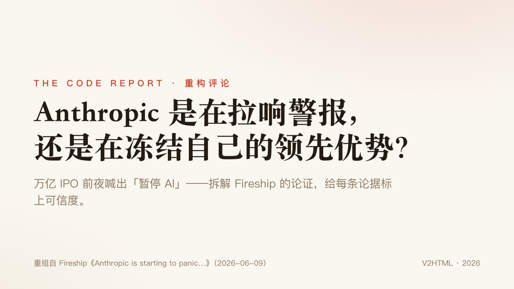
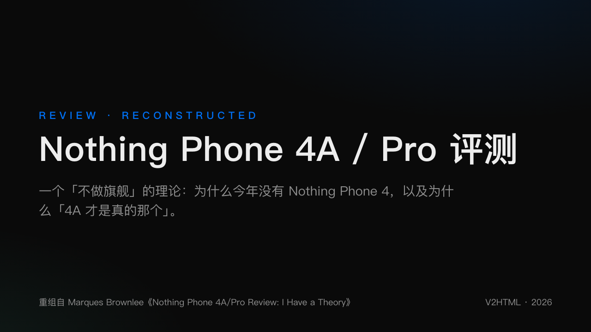

<div align="center">

# ConFlow

### 视频 ⇄ HTML 双向内容引擎

把一条 YouTube 视频,变成**可直接上线的文章**与**重新设计的可放映幻灯片**;再把任意文章,变成**可生成的视频物料**。

[](https://www.python.org/)
[](https://fastapi.tiangolo.com/)
[](templates/slides.html)
[](#license)

**[在线演示 · 幻灯片](https://nownexts.com/VTH/output/aircAruvnKk/slides.html)** ·
**[管理后台](https://nownexts.com/VTH/admin)** ·
[快速上手](#快速上手) · [核心能力](#核心能力) · [定位说明](#定位说明) · [使用指南](#使用指南) · [当前边界](#当前边界)

</div>

---

## 这是什么

看视频学东西很慢,视频里的知识**没法搜索、没法引用、没法分享**;而把视频手工整理成文章和 PPT,一小时的视频往往要花三小时。ConFlow 把这件事变成一条命令。

它把工作拆成两层:**确定性工作**(抓取、字幕、抽帧)交给脚本,**语义工作**(文体判定、结构重组、写作、幻灯片设计)交给 LLM。产出不是流水账字幕,而是按论证结构重写的、可直接发布的内容——数字逐字核对、补全显式标注、作者立场与写作者立场分离,这些防幻觉规则写在 `prompts/` 里,客户端与服务端共用同一套方法论。

反方向同样成立:`v2video` 把一篇文章或一组幻灯片逆向成**分镜提示词包**(Sora / Veo / 可灵可直接用),或输出 HTML 动画演示——视频和文档从此双向互通。

| 视频类型 | 产出 | 示例 |
|---|---|---|
| 教程类 | 可复现的教程文档(命令逐字核对 + 避坑清单) | Docker 入门 → 教程 |
| 科普类 | 分层递进的科普文章(直觉 → 机制 → 边界 + FAQ) | 3Blue1Brown → 科普 |
| 口播评论 | 论点拆解 + 论据可信度分级(✅⚠️❌) | Fireship → 评论 |
| 评测/访谈 | 评分卡前置的评测纪要 / 议题分组纪要 | MKBHD → 评测 |

**同一次分析,同时产出**:`doc.md`(文章)+ `slides.html`(30 主题重构型幻灯片,非截图拼贴)。

## 核心能力

- **四文体自动判定** — 教程 / 科普 / 评论 / 评测访谈各有专属写作法(`prompts/doc-*.md`),分类规则驱动,也可手工指定
- **30 主题幻灯片引擎** — 单文件零依赖,重构而非截图拼贴;仅嵌入含独有信息的原视频帧,每页标注时间戳;浏览器放映(`→` 翻页 / `O` 总览 / `F` 全屏 / `P` 导出 PDF / `T` 实时换主题)
- **逆向 v2video** — 文章 / PPT → 分镜提示词包(Sora / Veo / 可灵)或 HTML 动画演示
- **双形态运行** — ZCode 客户端技能(`/v2html` `/v2video`,质量上限最高)或 FastAPI 服务端(浏览器提交、任务队列、全自动)
- **管理后台** — 仪表盘、任务管理(重试 / 推送 / 删除)、执行日志与文档预览、LLM 在线热配置与连接测试
- **HTTP API** — 创建 / 查询 / 重试 / 推送任务,LLM 与推送配置热更新;公网部署可加 `CONFLOW_TOKEN` 鉴权
- **推送到 OpenFlow** — 任务完成后自动把文章写入 [OpenFlow](https://github.com/sevenaaaaaaaaa/openflow) 内容库(幂等覆盖、写前备份),默认草稿态、后台一键发布

| 科普 · 夜紫主题 | 评论 · 暖纸衬线主题 |
|---|---|
|  |  |
|  |  |

| 教程 · 深空蓝主题 | 评测 · 纯黑极简主题 |
|---|---|
|  |  |

## 快速上手

### 客户端(配合 ZCode,质量上限最高)

```bash
git clone https://github.com/sevenaaaaaaaaa/V2HTML.git && cd V2HTML
pip3 install yt-dlp                      # ffmpeg 需已安装
bash bin/install-skills.sh               # 注册 /v2html /v2video 技能
```

之后在 ZCode 里说一句:**"用 v2html 把这条视频转成教程和幻灯片:<url>"** 即可。

### 服务端(浏览器提交,全自动)

```bash
git clone https://github.com/sevenaaaaaaaaa/V2HTML.git && cd V2HTML
python3 -m venv .venv && .venv/bin/pip install -r requirements.txt
echo "CONFLOW_LLM_API_KEY=你的key" >> .env    # 任何 OpenAI 兼容接口
bash server/run.sh                           # http://0.0.0.0:8400
```

打开 `http://localhost:8400` 提交链接,等待产物;`/admin` 进入管理后台。公网部署(Apache 子路径 + systemd)与 API 鉴权见下。

<details>
<summary><b>公网服务器部署(本项目线上形态)与 HTTP API</b></summary>

```bash
# 1) 环境(CentOS7 等老系统:uv 装 Python3.12,ffmpeg 用全静态构建)
uv venv --python 3.12 .venv && uv pip install --python .venv/bin/python -r requirements.txt
# 2) 环境变量
cat > .env <<EOT
CONFLOW_LLM_API_KEY=你的key
CONFLOW_LLM_BASE_URL=https://api.deepseek.com/v1
CONFLOW_LLM_MODEL=deepseek-chat
EOT
# 3) systemd(ExecStart 用 .venv/bin/uvicorn server.app:app --host 127.0.0.1 --port 8410)
# 4) Apache 子路径反代 /VTH/ → 127.0.0.1:8410(nginx 同理)
```

管理后台首次启动前:`.venv/bin/python -c "import sys;sys.path.insert(0,'.');from server import auth;auth.set_credentials('admin','你的密码')"`。
公网部署设置 `CONFLOW_TOKEN`(旧 `V2HTML_TOKEN` 仍兼容),写接口需要 `Authorization: Bearer <token>`。

| 方法 | 路径 | 说明 |
|---|---|---|
| `POST` | `/api/jobs` | 创建任务 `{url, doc_type: auto\|tutorial\|science\|commentary\|other, theme, max_frames}` |
| `GET` | `/api/jobs` / `/api/jobs/{id}` | 任务列表 / 详情(进度、日志、产物链接) |
| `POST` | `/api/jobs/{id}/retry` `/push` `/delete` | 重试 / 推送 openflow / 删除 |
| `GET / POST` | `/api/config` | 读取 / 更新 LLM 与推送配置 |
| `GET` | `/api/health` | 健康检查(LLM/代理/推送状态) |

</details>

## 定位说明

ConFlow 属于芭乐派产品矩阵的**第三层:Studio 套件**——偏本地工具的产品层。矩阵的分层是:

- **OpenFlow = 入口层**:TIPS all-in-one,让一人团队(OPC)与中小团队低门槛完成数字化 + AI 化。
- **Flow 家族 = 进阶层**:MFlow / inFlow / UserLoop / PayFlow / LearnFlow / WebsFlow 按需进阶,各自深耕一个业务场景。
- **Studio 套件 = 本地工具层**:ConFlow、ThirdC(知识工作台)、InputFlow(隐私输入法)、ZeroZen(广告净化)等,吸引更多用户,长期方向是**作为工作台打通所有 Flow 产品**。

与 OpenFlow 矩阵是**松耦合**:ConFlow 可以完全独立使用(客户端技能或自建服务端);也可以一键把产出推入 OpenFlow 内容库,作为矩阵的内容供给端——视频 → 文章 → 站点发布,一条链路。

## 使用指南

完整使用指南(素材管线参数 / 四文体写作法 / 幻灯片主题定制 / 推送与 API 示例)见 [docs/USAGE-GUIDE.md](docs/USAGE-GUIDE.md)。
方法论与提示词资产直接可读:[prompts/](prompts/)(分类规则 · 四种文体写作法 · 幻灯片设计法 · 逆向分镜法)。

## 当前边界

- **任务列表不持久化**:服务端重启后任务列表清空(已产出的文件不受影响),持久化在路线图
- **无字幕视频无兜底**:当前依赖 YouTube 字幕(人工字幕优先);Whisper 容器兜底未接入,无字幕视频会失败
- **需要你自己的 LLM key**:语义层依赖任意 OpenAI 兼容接口;客户端形态则由 ZCode 承担
- **版权自查**:重建内容版权归原作者所有,发布前请确认授权(本页幻灯片同理)

## License

© 2026 · 保留所有权利(all rights reserved)。`prompts/` 与 `templates/` 中的方法论资产可在仓库内使用,二次分发请先开 Issue 沟通;幻灯片主题中的设计系统收编自 Vercel Geist、IBM Carbon、Ant Design、TDesign、Arco Design、Material 3 的公开 token(详见 [templates/slides.html](templates/slides.html) 致谢)。

<div align="center">

**ConFlow** — 看完一条视频,得到一堆可上线的内容。

</div>
